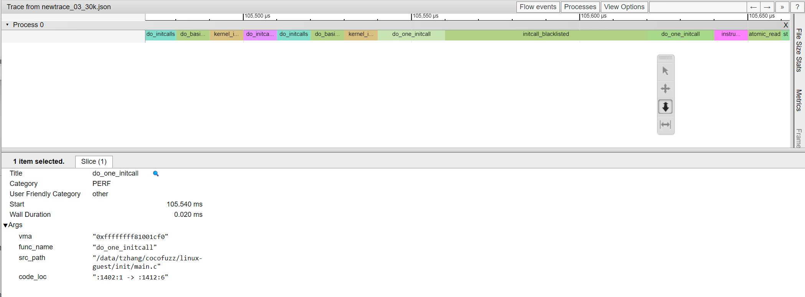
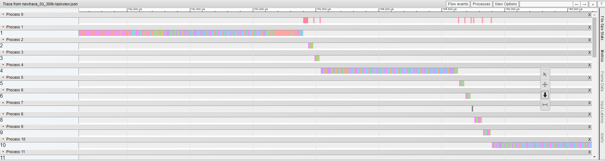
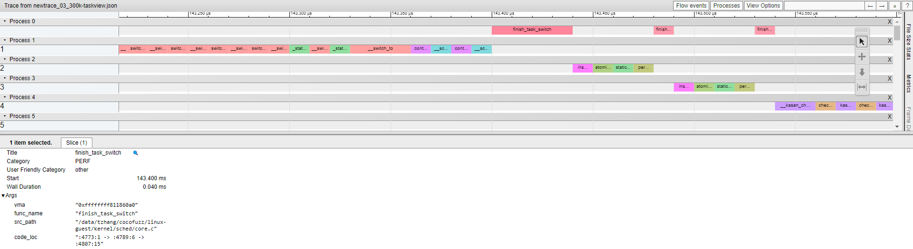

# Visualizing execution steps for a single fuzzing instance: an example

The kAFL tracing facility records the execution during the fuzzing campaign. It can provide an addr2line trace dump containing execution steps with block information. These dumps are already used in the audit and coverage process. Additionally, visualizing the execution steps might help debug or illustrate the cause of a crash.

[Catapult](https://chromium.googlesource.com/catapult/+/HEAD/README.md) contains tools from Chromium developers for performance analysis, testing, and monitoring of Chrome. Several tools can also be used for general cases. For instance, we can utilize [Trace-viewer](https://chromium.googlesource.com/catapult/+/HEAD/tracing/README.md) to visualize the execution steps from a single fuzzing campaign. It takes a particular [format](https://docs.google.com/document/d/1CvAClvFfyA5R-PhYUmn5OOQtYMH4h6I0nSsKchNAySU/preview) of JSON or Linux ftrace as input.

The example below shows how to generate a single trace dump from a fuzzing campaign, use [`parser4tv.py`](../bkc/util/parser4tv/parser4tv.py) for trace conversion, and visualize the execution steps using Trace-Viewer.

## The basic example
The example assumes a complete setup of the kAFL fuzzing environment and a finished fuzzing campaign.

### Generate trace dump

Pick a a single trace file. Generate addr2line trace dump with block information using the helper script:

`$BKC_ROOT/bkc/kafl/gen_addr2line.sh $KAFL_WORKDIR/traces/fuzz_00003.lst.lz4`

Since we try to visualize a linear execution flow, the above generates a complete dump instead of sorting and keeping the unique blocks.

The processing time varies depending on the execution path and can be lengthy. Therefore, processing multiple traces in parallel is recommended. This procedure can also be improved by providing different slicing functionalities.

### Convert to Trace-Viewer compatible json
In this example we visualize the first 30k entries, with `-s 30000`.  See `parser4tv` [`README`](../bkc/util/parser4tv/README.md) for more options.

`$BKC_ROOT/bkc/util/parser4tv/parser4th.py -s 30000 fuzz_00003.lst.addr.lst -o newtrace_03_30k.json`

### Prepare Catapult
Visit Catapult [upstream](https://chromium.googlesource.com/catapult/) and clone a branch:

`git clone https://chromium.googlesource.com/catapult`

In the steps below, we assume a local repository of Catapult can be accessed via $CATAPULT. Note this is a manual step, and the environment variable is set by choice.

### Turn JSON trace file into a standalone HTML with the Trace-Viewer utility

`$CATAPULT/tracing/bin/trace2html newtrace_03_30k.json --output=trace_03_30k.html`

### Launch Trace-Viewer for visualization
Open `newtrace_03_30k.html` in a browser:

The screenshot shows sequential events from the same call are automatically merged. The transition between different code locations is listed under the code_loc alongside the virtual memory address `vma` and the path of the source `src_path`. These detail can be viewed by clicking each event.

Check trace-viewer [page](https://chromium.googlesource.com/catapult/+/HEAD/tracing/README.md) for more ways to interact the view.

## Experimental feature: `--task_view` 
Although each fuzzing instance assumes a single logical core for execution, it will be helpful to provide thread-level granularity when visualizing the execution steps. This is because each trace contains many operations from ancillary subsystems such as kafl agent and kasan. A thread-level view can help focus on the native events.

Use `--task_view` to enable this experimental feature: 

`$BKC_ROOT/bkc/util/parser4tv/parser4th.py --task_view -s 300000 fuzz_00003.lst.addr.lst -o newtrace_03_300k-taskview.json`

An example of task view shows as follows:

Note that the process # on the left represent different tasks instead of the common understanding of processes.

The zoomed-in view shows that the current `--task_view `implementation relies on the anchor `function finish_task_switch()` for simplicity which overlooks the other part of the context switch routine, e.g., `__switch_to()`, `__schedule()`, etc.

Note that the current implementation of `--task_view` is preliminary and has low accuracy in differentiating threads. 
This is due to the challenges of inferring context switches solely through edge flows, including the randomness of the execution flow, various triggering scenarios, shared utility calls, missing block information (i.e., `??` records), and arch-specific operations. A more detailed heuristic can improve this with buffering.