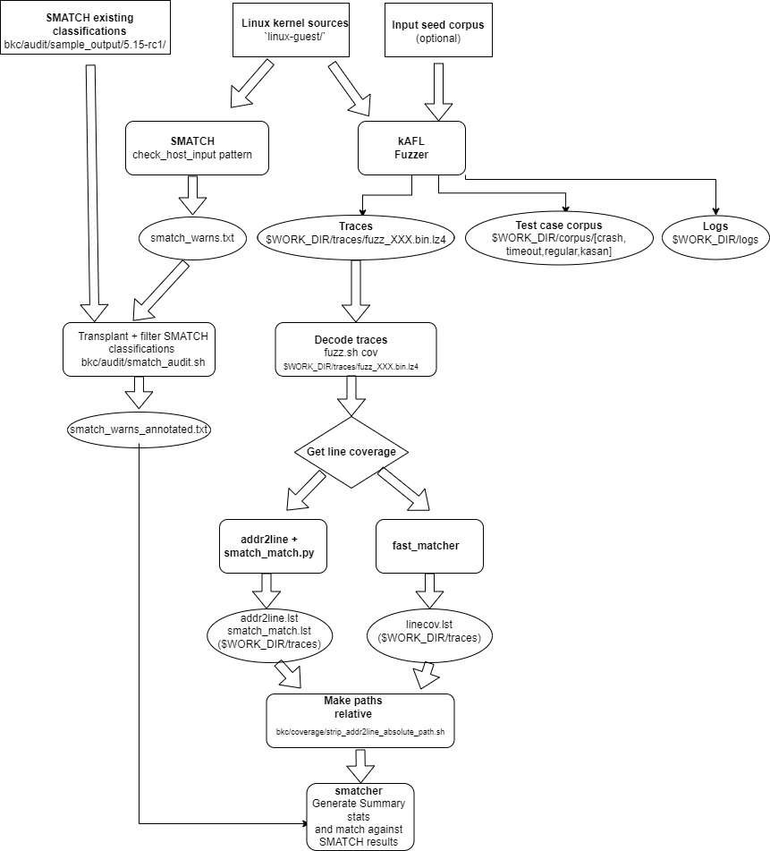

# Workflow Components and Automation

For full validation of a target, we run several fuzzing harnesses and compare
their aggregated coverage against the smatch audit list. The smatch audit list
is automatically generated for the desired target kernel and configuration,
with filters and annotations applied based on previous manual code review.

Output of a full campaign are
- smatch coverage report, mapping the achieved fuzzer coverage against the audit list
- fuzzer findings report, summarizing the identified crashes/bugs across all harnesses
- fuzzer performance report, for tuning and spotting regressions in individual harnesses

## 1. Components Overview



The overall workflow consists of multiple steps and tools executing in
a pipeline. The pipeline is optimized to automate a campaign on a single server
with many CPUs. However, the development of individual harnesses or debugging
of a crash requires working with low-level kernel configuration, build flags and
kAFL/VM setup. As a result, the typical user will be more concerned with the
individual helper tools and their configuration, while the overall campaign setup and
execution pipeline mostly just chains them together.

The most important components are:

### 1.1. Smatch Audit Scripts ('bkc/audit/')

We use smatch to statically obtain points that potentially consume host input,
which we then want to reach through fuzzing. The smatch audit scripts define
the rules to find these inputs, filter and annotate them based on previous
reviews. For more detail please refer to the
[Static Analyzer and Code Audit](https://intel.github.io/ccc-linux-guest-hardening-docs/tdx-guest-hardening.html#static-analyzer-and-code-audit)
section in the handbook.


The smatch audit lists should be generated for the desired target kernel and
configuration that will be subjected to fuzzing, so that the reported file names
and numbers can be matched up in the end.

The generation, filtering and annotation/transfer steps are encapsulated in
a helper script `bkc/audit/smatch_audit.sh`, which is also executed as part of
the `make prepare` step to initialize basic campaign/fuzzing assets:

  ```
  Usage: ./bkc/audit/smatch_audit.sh <dir> <config>
  
  Where:
    <target>  - output directory for storing smatch results
    <config>  - kernel config to be used in build/audit
  ```

For more info on smatch audit lists, rules and annotation, see
[the related section](https://intel.github.io/ccc-linux-guest-hardening-docs/tdx-guest-hardening.html#applying-code-audit-results-to-different-kernel-trees)
in the handbook.

### 1.2 kAFL Launcher (`bkc/kafl/fuzz.sh`)

kAFL launches the target in a modified x86/VM. In addition to various fuzzer
configuration options, there are several VM configuration options that may be
relevant to a particular harness.

The `fuzz.sh` launcher helps to integrate the various components and start kAFL
with a consistent configuration:

- VM configuration, initrd, kernel image and TDVF picked up from $PWD and $BKC\_ROOT
- Default fuzzer configuration plus any cmdline override
- Additional arguments, options needed for individual use-cases, e.g. debug
  an identified crash, compute coverage of a campaign, or building a target kernel.

Basic usage is printed on `-h`:

  ```
  $ ./bkc/kafl/fuzz.sh -h
  
  Usage: ./bkc/kafl/fuzz.sh <cmd> <dir> [args]
  
  Available commands <cmd>:
    run    <target> [args]  - launch fuzzer with optional kAFL args [args]
    single <target> <file>  - execute target from <dir> with single input from <file>
    debug  <target> <file>  - launch target with single input <file>
                              and wait for gdb connection (qemu -s -S)
    cov <workdir>           - re-execute all payloads from <workdir>/corpus/ and
                              collect the individual trace logs to <workdir>/trace/
    smatch <workdir>        - get addr2line and smatch_match results from traces
  
    build <dir> <build>     - use harness config at <dir> to build kernel at <build>
    audit <dir> <config>    - smatch-audit guest-kernel using <config> and store to <dir>
  
  <target> is a folder with vmlinux, System.map and bzImage
  <workdir> is the output of a prior fuzzing run (default: /dev/shm/kafl_steffens).
  
  On 'run', the target files are copied to <workdir>/target for later diagnostics.
  ```

For getting started, the most interesting steps are `fuzz.sh build` and `fuzz.sh
run`, which build a kernel based on a desired configuration, and launch
a fuzzing campaign for that kernel.

Note: In addition to default paths and options, the launcher also copies essential
configuration and input files to the fuzzer `<workdir>/target/` directory. They
are automatically picked up by the `cov` and `debug` steps to ensure consistent
execution also with multiple or older campaigns/workdirs.

### 1.3 Coverage and Campaign Reports

The kAFL fuzzer reports coverage in terms of binary basic block transitions. The
binary coverage must be decoded and mapped to source file/line information, and
which can then be mapped against the smatch audit lists (#1.1).

There are multiple tools involved in this step:

- `fuzz.sh cov` uses the `kafl_cov.py` tool to obtain the list of seen block
  transitions for a given corpus of inputs. The binary and decoded traces, and
  a summary of unique seen edges are stored to `<workdir>/traces`

- `fuzz.sh smatch` with `USE_GHIDRA=1`, uses Ghidra and `eu-addr2line` to
  generate the full set of covered binary code pointers and translate them to
  a list of source file/line at `<workdir>/traces/addr2line.lst`. Finally, a basic
  string-matching against the smatch audit list (#1.1) is done to generate
  <workdir>/traces/smatch_match.lst` for each harness.

- `fuzz.sh smatch` with `USE_FAST_MATCHER=1` uses the custom `fast_matcher`
  tool instead of Ghidra, to generate the list of covered files/lines at <workdir>/traces/linecov.lst

- `smatcher` scans a given target directory for addr2line.lst, linecov.lst or
  smatch_match.lst and produces a report for the aggregated coverage against the
  smatch audit lists.

- `stats.py` scans a campaign folder for kAFL workdirs and generates an
  overview of the fuzzer performance/findings per workdir.

- `summarize.sh` scans a campaign folder for kAFL workdirs and generates an
  overview of the identified crashes/findings. Basic heuristics are applied to
  bucket similar crash reports prioritize by type/impact.

### 1.4 Reproduction and Diagnosis

When crash reports are not sufficient, a crash can be reproduced by re-launching
a kAFL/Qemu instance with the given crashing input (payload).

- `fuzz.sh single` launches a VM based on kernel/initrd stored alongside the
  fuzzer results in `<workdir>/target`. By default, it also supplies the
   `--resume` flag to directly restore the Qemu snapshot stored in the workdir.
  This generally increases the chance of reproducing the crash, but is
  incompatible with supplying alternative kernel/initrd inputs.

- `fuzz.sh debug` works like `single` but also enables the Qemu gdbserver. The
  VM stops immediately after launch and waits for gdb attach. The kAFL/Qemu
  gdb frontend can be buggy, but it supports hardware breakpoints (hbreak) and
  dumping CPU register state.


Note: Since Qemu/KVM emulation is not cycle-accurate and guest execution may
sometimes depend on intermediate state of Qemu/KVM that is not part of
snapshot/restore, not all identified crashes can always be reproduced. It can
help in these cases to fix other / more obvious bugs first, to try other inputs
or harnesses leading to the same crash, or to execute multiple times and analyze
the reported binary coverage for the diverging executions (see `fuzz.sh noise` tool).

## 2. Automation Pipeline

Following above individual steps, a number of harnesses and associated
configuration/assets have been defined that should be executed for any desired
candidate kernel. The automation is currently split three parts:

- `make prepare`, executed from the top-level directory, generates basic
  resources needed as input to campaign/harness setups. This includes a
  basic `initd.cpio.gz`, `disk.img` and `sharedir` needed by some harnesses,
  as well as the smatch audit lists generated for the current kernel and config.

- `init_harness.py` is used to capture harness-specific configuration and
  default resources. It generates a "campaign" directory with configuration and resources
  for the selected harnesses. The file layout is done in such a way that the `fuzz.sh`
  helper can also be executed directly from a generated harness directory, to
  manually execute the overall pipeline and debug individual steps. Example:

  ```
  $ init_harness.py ~/data/mycampaign VIRTIO
  $ cd ~/data/mycampaign/BPH_VIRTIO_PCI_PROBE
  $ mkdir my_build
  $ fuzz.sh build . my_build
  $ fuzz.sh run mybuild -p 16 --abort-time 1
  $ fuzz.sh cov $KAFL_WORKDIR
  ```

- `pipeline.py` is used to automate fuzzing and processing of a range of
  harnesses on a local system. In the simplest case, the tool generates a
  new campaign directory with selected harnesses (using `init_campaign.py`)
  and then schedules parallel execution of the various above steps across the
  available/detected CPUs. The most interesting options are the
  `--harness PATTERN` selection and number of fuzzer workers per harness:

  ```
  $ pipeline.py -p 16 ~/data/mycampaign BOOT
  ```

  By default, `pipeline.py` will generate and fuzz all known harness
  configurations. It will also try to resume work if the campaign directory
  already exists, skipping existing kernel builds and starting new fuzzing jobs
  only for harnesses where no existing <workdir> output was found.


## 3. Campaign Reports

- smatch_match.txt

- summary.html

- stats.html
